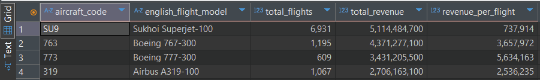
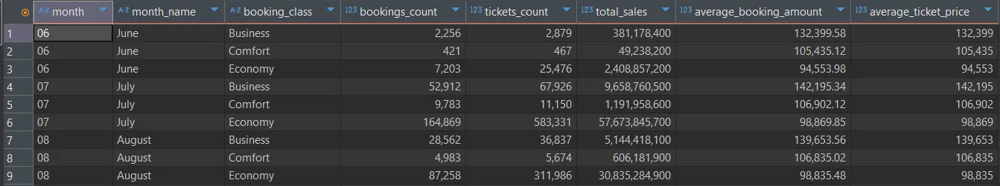
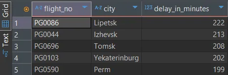
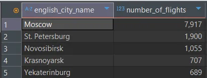
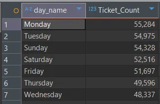
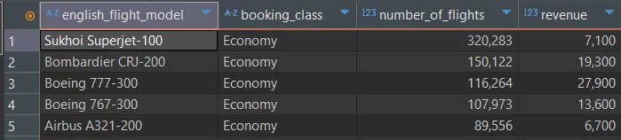

# Airline Data Cleaning & Analysis

## [ Cleaning ]

### 1. Potential Irrelevant Data

```sql
PRAGMA table_info(boarding_passes);
SELECT * FROM boarding_passes bp LIMIT 20;
PRAGMA table_info(bookings);
SELECT * FROM bookings b LIMIT 20;
```

- Overview of data shows that all columns in all 8 tables seem to have `NOT NULL` constraints.

### 2. Duplicate Data

```sql
SELECT
    COUNT(ticket_no) AS total,
    COUNT(DISTINCT ticket_no) AS unique_tickets
FROM boarding_passes bp;
-- ^CHECKING boarding_passes first, more than half of the tickets have the same ticket number, unusually high
```


```sql
WITH duplicates_boardingpasses AS (
    SELECT *,
        ROW_NUMBER() OVER(PARTITION BY bp.ticket_no ORDER BY ticket_no) AS rownum_boardingpasses
    FROM boarding_passes bp
)
SELECT COUNT(rownum_boardingpasses) FROM duplicates_boardingpasses
WHERE rownum_boardingpasses > 1;
-- ^double checking with window function, count shows the difference
```


```sql
WITH duplicates_boardingpasses AS (
    SELECT *,
        ROW_NUMBER() OVER(PARTITION BY bp.ticket_no, bp.flight_id ORDER BY ticket_no) AS rownum_boardingpasses
    FROM boarding_passes bp
)
SELECT * FROM duplicates_boardingpasses
WHERE rownum_boardingpasses > 1;
-- ^partitioning by ticket number and flight id yields 0 results so assuming all tickets in boarding_passes is unique
-- Using `ticket_no` and `flight_id` for uniqueness.
```

### 3. Structural Errors (Naming, Typos, NULLs, Capitalizaions, Extra Spaces)

```sql
SELECT COUNT(*) AS total_rows,
    SUM(CASE WHEN ticket_no IS NULL THEN 1 ELSE 0 END) AS null_count,
    SUM(CASE WHEN ticket_no = '' THEN 1 ELSE 0 END) AS empty_string_count,
    SUM(CASE WHEN ticket_no IN ('N/A', '-', 'unknown', '0') THEN 1 ELSE 0 END) AS placeholder_count
FROM boarding_passes bp;
-- ^checking for placeholder values
```

### 4. Missing Data & NULLs

```sql
SELECT COUNT(*)
FROM flights f
WHERE actual_departure != '\N' OR actual_arrival != '\N';
-- ^flights have ' \N ' value in columns, a signficiant amount of these flights have not happened but are scheduled
```

### 5. Standardization (Datatypes, Numerics)

```sql
SELECT
    json_extract(ac.model, '$.en') AS english_flight_model
FROM aircrafts_data ac;
```

```sql
ALTER TABLE aircrafts_data ADD COLUMN english_flight_model TEXT;
UPDATE aircrafts_data
SET english_flight_model = json_extract(model, '$.en');
-- ^Extracting English flight model names.
```

```sql
ALTER TABLE airports_data ADD COLUMN english_airport_name TEXT;
ALTER TABLE airports_data ADD COLUMN english_city_name TEXT;
UPDATE airports_data
SET english_airport_name = json_extract(airport_name, '$.en'),
    english_city_name = json_extract(city, '$.en');
-- ^Extracting English airport and city names.
```

### 6. Outliers

### 7. Merge, Transform, Drop

- Exporting cleaned tables for **Tableau visualization**.

---

## [ Analysis ]

### 1. Total Revenue

```sql
SELECT SUM(amount) FROM ticket_flights tf;
```

### 2. Most Profitable Aircraft Models

```sql
SELECT
    ac.aircraft_code, ac.english_flight_model,
    COUNT(DISTINCT f.flight_id) AS total_flights,
    SUM(tf.amount) AS total_revenue,
    SUM(tf.amount) / COUNT(DISTINCT f.flight_id) AS revenue_per_flight
FROM aircrafts_data ac
JOIN flights f ON ac.aircraft_code = f.aircraft_code
JOIN ticket_flights tf ON f.flight_id = tf.flight_id
GROUP BY ac.aircraft_code
ORDER BY total_revenue DESC;
```



### 3. Airports: Outbound & Inbound flights, Total Flights, # of Passengers, Total Revenue, Average Ticket Price

```sql
WITH airport_flights AS (
    SELECT departure_airport AS airport_code, 'outbound' AS direction, COUNT(flight_id) AS flight_count
    FROM flights GROUP BY departure_airport
    UNION ALL
    SELECT arrival_airport AS airport_code, 'inbound' AS direction, COUNT(flight_id) AS flight_count
    FROM flights GROUP BY arrival_airport
),
-- ^airport_flights CTE, making a table that has airports appearing twice, once with its outbound flights and once with its inbound flights; and flight count
revenue_data AS (
    SELECT 
        f.flight_id, f.departure_airport, f.arrival_airport,
        SUM(tf.amount) AS flight_revenue,
        COUNT(tf.ticket_no) AS passenger_count
    FROM 
        flights f
    JOIN 
        ticket_flights tf ON f.flight_id = tf.flight_id
    GROUP BY 
        f.flight_id, f.departure_airport, f.arrival_airport
)	
-- ^revenue_data CTE, making a table that has revenue and passenger count for flights by joining flights and ticket_flights table
SELECT 
    ap.airport_code, ap.english_airport_name, ap.english_city_name, ap.timezone,
    SUM(CASE WHEN af.direction = 'outbound' THEN af.flight_count ELSE 0 END) AS outbound_flights,
    SUM(CASE WHEN af.direction = 'inbound' THEN af.flight_count ELSE 0 END) AS inbound_flights,
    SUM(af.flight_count) AS total_flights,
    (
        SELECT SUM(rd.flight_revenue)
        FROM revenue_data rd
        WHERE rd.departure_airport = ap.airport_code OR rd.arrival_airport = ap.airport_code
    ) AS total_revenue,
    	-- ^summing revenue from all flights when airport is either departure or arrival
    (
        SELECT SUM(rd.passenger_count)
        FROM revenue_data rd
        WHERE rd.departure_airport = ap.airport_code OR rd.arrival_airport = ap.airport_code
    ) AS total_passengers,
    	-- ^counting passengers from all flights when airport is either departure or arrival
    (
        SELECT SUM(rd.flight_revenue) / SUM(rd.passenger_count)
        FROM revenue_data rd
        WHERE (rd.departure_airport = ap.airport_code OR rd.arrival_airport = ap.airport_code)
          AND rd.passenger_count > 0
    ) AS avg_ticket_price
    	-- ^average ticket price by dividing total revenue by total passengers
FROM 
    airports_data ap
LEFT JOIN
    airport_flights af ON ap.airport_code = af.airport_code
GROUP BY 
    ap.airport_code, airport_name, city, ap.timezone
ORDER BY 
    total_revenue DESC;
```


### 4. Monthly Booking Overview

```sql
SELECT
    strftime('%m', SUBSTR(m.book_date,1,19)) AS month,
    -- ^strftime('%m', b.book_date) AS month doesn't work, returning nulls in SQLITE because of timezones, need to be more specific with substring
    CASE strftime('%m', SUBSTR(m.book_date,1,19))
        WHEN '06' THEN 'June'
        WHEN '07' THEN 'July'
        WHEN '08' THEN 'August'
    END AS month_name,
    m.fare_conditions AS booking_class,
    COUNT(DISTINCT m.book_ref) AS bookings_count,
    COUNT(m.ticket_no) AS tickets_count,
    SUM(m.total_amount) AS total_sales,
    ROUND(AVG(m.total_amount),2) AS average_booking_amount,
    SUM(m.total_amount)/COUNT(m.ticket_no) AS average_ticket_price
FROM (
    SELECT * FROM bookings b
    JOIN tickets t ON b.book_ref = t.book_ref
    JOIN ticket_flights tf ON t.ticket_no = tf.ticket_no
) AS m
GROUP BY month, booking_class
ORDER BY month, booking_class;
```



### 5. Flight Average Occupancy Rate

```sql
WITH total_seats AS (
    SELECT aircraft_code, COUNT(seat_no) AS seat_count
    FROM seats GROUP BY aircraft_code
    -- ^first CTE counts total seats for each aircraft
),
occupied_seats AS (
    SELECT flight_id, COUNT(ticket_no) AS occupied_count
    FROM boarding_passes GROUP BY flight_id
    -- ^second CTE counts occupied seats for each flight
)
SELECT
    f.flight_no,
    ROUND((CAST(SUM(o.occupied_count) AS REAL) / CAST(SUM(t.seat_count) AS REAL)) * 100, 2) AS avg_occupancy_rate
FROM flights f
JOIN total_seats t ON f.aircraft_code = t.aircraft_code
LEFT JOIN occupied_seats o ON f.flight_id = o.flight_id
GROUP BY f.flight_no
ORDER BY avg_occupancy_rate DESC;
```


### 6. Flights with the Longest Delays

```sql
WITH all_flights AS (
    SELECT substr(f.scheduled_departure, 1, 19) AS scheduled_departure,
           substr(f.actual_departure, 1, 19) AS actual_departure,
           f.flight_no,
           ap1.english_city_name AS city
    FROM flights f
    JOIN airports_data ap1 ON f.departure_airport = ap1.airport_code
)
SELECT flight_no, city,
    (strftime('%s', datetime(actual_departure)) - strftime('%s', datetime(scheduled_departure))) / 60 AS delay_in_minutes
FROM all_flights
ORDER BY delay_in_minutes DESC
LIMIT 20;
```



### 7. Most Traveled to Cities

```sql
SELECT 
    ap1.english_city_name,
    COUNT(f.flight_no) AS number_of_flights        
FROM flights f
JOIN airports_data ap1 ON f.departure_airport = ap1.airport_code
JOIN airports_data ap2 ON f.arrival_airport = ap2.airport_code
GROUP BY ap1.english_city_name
ORDER BY number_of_flights DESC;
```



### 8. Most Traveled Days

```sql
SELECT 
	CASE strftime('%w', SUBSTR(b.book_date , 1, 19))
           WHEN '0' THEN 'Sunday'
           WHEN '1' THEN 'Monday'
           WHEN '2' THEN 'Tuesday'
           WHEN '3' THEN 'Wednesday'
           WHEN '4' THEN 'Thursday'
           WHEN '5' THEN 'Friday'
           WHEN '6' THEN 'Saturday'
       END AS day_name,
    COUNT(t.ticket_no) AS Ticket_Count
FROM bookings b 
JOIN tickets t ON b.book_ref = t.book_ref 
GROUP BY day_name 
ORDER BY Ticket_Count DESC;
```



### 9. Ratio of Bookings to Tickets

```sql
SELECT ticket_count, COUNT(books_tickets.book_ref ) AS number_of_bookings
	FROM (
	SELECT
		tickets.book_ref, 
		COUNT(ticket_no) AS ticket_count
    FROM tickets
    GROUP BY book_ref
	) AS books_tickets
GROUP BY ticket_count
ORDER BY ticket_count;
```


###  10. Most Popular Aircraft Model with Booking Class and Revenue

```sql
SELECT 
	ac.english_flight_model,
	tf.fare_conditions AS booking_class,
	COUNT(f.flight_no) AS number_of_flights,
	tf.amount AS revenue
FROM flights f 
JOIN aircrafts_data ac ON f.aircraft_code = ac.aircraft_code 
JOIN ticket_flights tf ON f.flight_id = tf.flight_id 
GROUP BY ac.aircraft_code, booking_class 
ORDER BY number_of_flights DESC;
```


